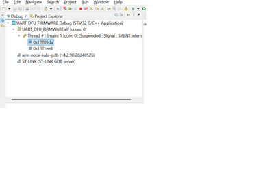

# UART_DFU_FIRMWARE
This is a simple project for demo of UART1 Bootloader for firmware upgrade. STM32F446RET6 - MCU

## overview
This project implements UART bootloader upgrade mechanism based on embedded system.This allows fiirmware updates over UART without the need of external programmer during normal operation. The DFU process is handled within tha application firmware and is intended for the development enviorment.

## Freature
-CLI command framework.
-Firmware upgrade with UART.

## Hardware Requirement
-STM32 Nucleo-F446RE 
-FTDI cable with TX,RX.
-STLINK for recovery and first time firmware update.

## Software Requirement
-STM32CubeIDE 
-STM32Programmer
-Serial Terminal (Teraterm)

## UART DFU Procedure
1.Flash the code in your board using STLINK.
2.Connect Teraterm.
3.Enter the System Bootloader using command "DFU" at the serial terminal.
4.upgrade using STM32Programmer through UART.
5.Firmware written to the Flash Memory.

## Failure Handling and Recovery
-If firmware failed or interrupted
-The device can be reprogrammed using STLINK or 
-enter the System bootloder by using BOOT0 --> high and press reset button program again through UART using STM32Programmer.

## Limitation
-There is no  failure recovery mechanism.
-No custome bootloader available, so cannot implement recovery mechanism.

## Debugging Technique 
-Run the code in Debug mode, Pause and check the address on the left side of debugger(it should be in the SYSTEM Memory address range 0x1FFF0000 - 0x1FFF7A0F)

## Details on Design
-32 bit Magic word written at the end address of SRAM starting from 0x2001FFFC.
-declared last 4 bytes of RAM in linker file as noninit bytes,otherwise it will not retain the magic value.
MEMORY
{
  RAM    (xrw)    : ORIGIN = 0x20000000,   LENGTH = 128K-32
  FLASH    (rx)    : ORIGIN = 0x8000000,   LENGTH = 512K
  MAGIC_RAM(rwx)	: ORIGIN = 0x2001FFFC, LENGTH = 32
}

add below assembly code before .data 
   .noinit (NOLOAD) :
  {
    . = ALIGN(4);
    *(.noinit)
    *(.noinit*)
    . = ALIGN(4);
  } > MAGIC_RAM    